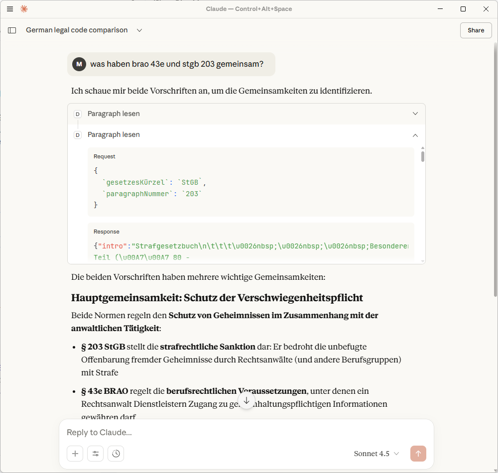

# Dejure MCP Server

This MCP Server makes German legislation accessible to agents.

It provides agents with a standardized way to browse

- ⚖️ fields of law,
- 📜 legislation,
- §§§ paragraphs.

That grounds your agent in actual legislation and reduces the risk of halucinations significantly.

At the same time its superior to basic web search, because the agent gets structured output and sees all paragraphs of a legislation directly.

All content is loaded on-demand from [dejure.org](https://dejure.org) via your machines internet connection (stdio transport only).

## Installation

Add it to your local agent (e.g. Claude Desktop's `claude_desktop_config.json`) like this:

```json
{
  "mcpServers": {
    "dejure": {
      "command": "D:\\DejureMcp\\DejureMcp.Stdio\\bin\\Debug\\net9.0\\DejureMcp.Stdio.exe"
    }
  },
}
```

Then your agent can answer ~~all~~ ~~most~~ some of your legal questions.



As a developer you can test it with the inspector:

```powershell
npx @modelcontextprotocol/inspector
```
